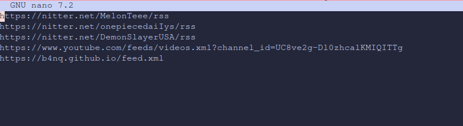
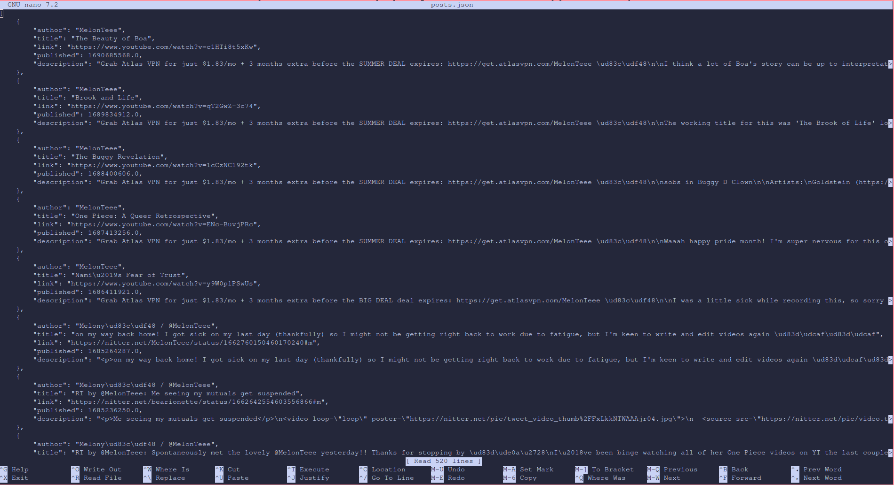

# hel
This program gets basic information about RSS/Atom feed and converts it into JSON in chronological order. It can be used as a foundation for various interfaces.       

## installation 
Clone this repository
```shell
git clone https://github.com/bankubanku/hel.git
```

Install dependencies 
```shell
pip install -r requirements.txt
```

## usage
Before running the script, you must first add URLs to chosen RSS or Atom feeds in `~/.hel/urls`



To use the script, go to cloned repository and run a command below
```shell
python hel.py 
```

Now parsed posts' details are saved in a `~/.hel/posts.json` file


